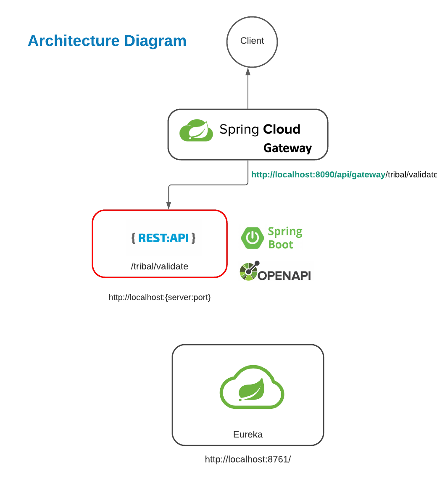

# credit-line

# Project Title

Microservice that determines the credit line that better suits to the customers in Tribal.

## Architecture

## Getting Started

### Installing

1.- Download the three projects found in the repository
2.- Import them into the reference IDE (Example: STS)
3.- Running tribal-credit-line-eureka
4.- Run tribal-credit-line-gateway-server
5.- Run tribal-credit-line (There is no specific port
established for this service, each time the service is executed it will be running on a different port,
if you want to change the port to a specific one, you must modify server.port = 0 in the application.properties file)
6.- Consume the POST service using the URL http: // localhost: 8090 / api / gateway / tribal / validate

Example Request:

{
  "businessType": "SME",
  "cashBalance": 435.30,
  "montlyRevenue": 4235.45,
  "requestedCreditLine": 100,
  "requestedDate": "2021-08-22T23:01:35.782Z"
}

### Executing program

Request using business type STARTUP

Request using business type SME

Request using business type STARTUP and credit line was rejected

